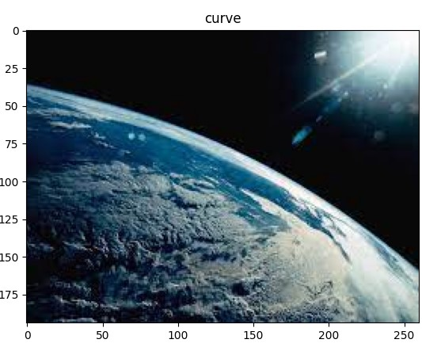
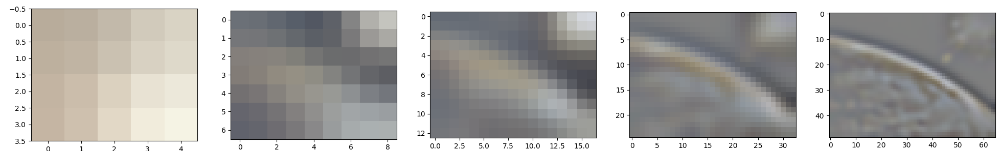
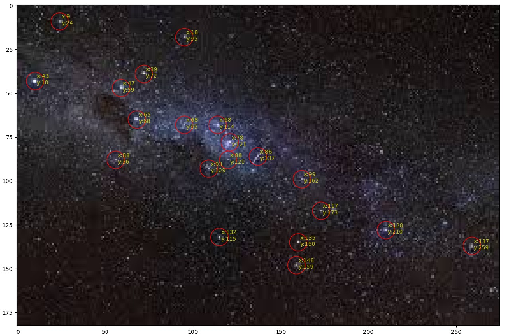

# Satellite Image Transfer
Nano-satellites are becoming more and more popular now days. 
Due to the size limitation the satellite communication is
based on a [LoRa](https://lora-alliance.org/) protocal radio transmitter. 
While LoRa can transmit to over long distance, it's band-with is very limited, around 
50 Bytes per a package.
LoRa is very useful in for short communication messages, such as location, altitude etc., 
but transmitting images, evan small ones, will need more than a thousand packages. 

## Our solution
In order to enable transferring images we suggest compressing by creating 
a Laplacian pyramid and compressing each layer. The layers are compressed efficiently 
due to each layer having a small set of values. Another advantage of the pyramid method,
is that the satellite can transmit each layer separately which will allow the ground 
station to have a better and better 'preview' with each layer transmitted. If the 
image is not interesting, the ground station can cancel the transmission before it 
"wasted" time before downloading the whole image.

### Classification
Another feature for evading unnecessary transferring has been added. 
For each image captured, the satellite will classify the image as one of the following
classes:
- Earth
- Earth Curvature
- Stars
- Aurora

The ground station could decide if the image is interesting or not. 
If the image captured stars, it creates a small file that contained the locations of the
stars. That file could be transferred by itself without the image, and could be analyzed
using [PH.D Revital Marbel](https://scholar.google.com/citations?user=TDQ192QAAAAJ&hl=en) 's
star tracker algorithm to extract the constellation in the picture.

## Run commands
To capture an image and compress it run the following command:

`python capture_image.py [demo]`

Use the 'demo' to run the process on an image from the data, otherwise it will 
capture an image using the computers' camera.
All the layers will be saved at the '../output' folder.

To reconstruct an image from laplacian layers run:

`python get_image.py <Path to laplacian layers folder>`

## Special Thanks
This project was done as a project part of "New Space Technologies" at Ariel University
- [Prof._Boaz Ben-Moshe](https://www.ariel.ac.il/wp/bmboaz/) - Head of 
  [K&CG](https://www.ariel-asc.com/) lab at Ariel University and the lecturer of the course.
- [Roni Ronen](https://www.linkedin.com/in/rony-ronen/) - Master at K&CG lab
- [Revital Marbel](https://scholar.google.com/citations?user=TDQ192QAAAAJ&hl=en) - PH.D at at K&CG lab
